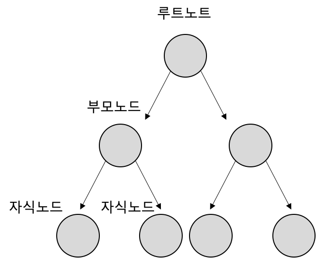

## Chapter15 Collection

> 다수의 객체 및 정보를 저장할때 배열을 사용한다 But **배열의 한계점** 존재!
>
> => 배열은 처음 생성 시 배열의 길이를 정하기 때문에 **불특정 다수의 객체 저장**에 힘들다 !
>
> => **객체 삭제**시 비효율적 (비어있는 인덱스 검색하는 로직 필요)
>
> **So** . 널리 알려진 자료구조를 바탕으로 객체들을 효율적으로 **추가, 삭제, 검색**할 수 잇도록 `java.util` 패키지에 컬랙션 관련 인터페이스와 클래스를 포함시켰고 이를 `컬렉션 프레임워크`라고 부른다.

주요 컬렉션 프레임워크 인터페이스

1. List
2. Set
3. Map

이 인터페이스들은 컬렉션을 사용하는 방법을 정의해둠


#### 1. Collection

 	ㄴList  	- ArrayList

​				 	- Vector

​				 	- LinkecdList


​	 ㄴSet	   - HashSet

​					 - TreeSet

​    

​	 - Map	  - HashMap

​					 - HashTable

​					 - TreeMap

​					 - Properties


>  List , Set은 객체 추가, 삭제, 검색하는 방법에 많은 공통점이 있기 때문에 이 인터페이스들의 공통된 메소드들만 모아  Collection 인터페이스로 정의되어 있고, Map은 키와 값을 하나의 쌍으로 묶어서 관리하는 구조로 되어 있어, 별도의 인터페이스에 구현되어 있다.

| 인터페이스 분류     | 특징                                               | 구현 클래스                             |
| ------------------- | -------------------------------------------------- | --------------------------------------- |
| Collection ( List ) | - 순서를 유지하고 저장 <br/>- 중복 저장 가능       | ArrayList, Vector, LinkedList           |
| Collection ( Set )  | - 순서를 유지하지 않고 저장 <br/>- 중복 저장 안 됨 | HashSet, TreeSet                        |
| Map                 | - 키와 값을 쌍으로 저장<br/> - 키는 중복 저장 안됨 | HashMap, HashTable, TreeMap, Properties |


#### 2. List Collection

> 객체를 일렬로 늘어놓은 구조로 객체를 인덱스로 관리하기 때문에 저장 시 자동 인덱스가 부여되며 인덱스를 통하여 객체 삭제, 검색 가능하다.
>
> 객체 자체를 저장 x => 객체의 번지를 참조 (동일 객체는 동일 번지를 참조)
>
> null값도 저장 가능 => 해당 인덱스는 아무 객체도 참조 x 


공통 메소드

| 기능      | 메소드                                                       | 설명                                                         |
| --------- | ------------------------------------------------------------ | ------------------------------------------------------------ |
| 객체 추가 | - boolean add(E e) <br/>- void add(int index, E element) <br/>- E set(int index, E element) | 객체를 맨 끝에 추가<br/>주어진 인덱스에 객체 추가<br/>주어진 인덱스에 저장된 객체를 주어진 객체로 변환 |
| 객체 검색 | - boolean contains(Object o) <br/>- E get(int index)<br/>- boolean isEmpty()<br/>- int size() | 주어진 객체가 저장 되었는지 여부 리턴 <br/>주어진 인덱스에 저장된 객체를 리턴<br/>컬렉션이 비어 있는지 조사<br/>저장되어 있는 전체 객체 수를 리턴 |
| 객체 삭제 | - void clear <br/>- E remove(int index) <br/>- boolean remove(Object o) | 저장된 모든 객체를 삭제<br/>주어진 인덱스에 저장된 객체를 삭제<br/>주어진 객체를 삭제 |


##### 2.1 ArrayList

>  List 인터페이스의 구현 클래스, 배열과 공통점은 **인덱스**로 객체가 관리가 된다. 하지만 **배열은 생성 시점에 크기가 고정**되고, 배열 사용중에 크기 변경이 불가능 하지만, **ArrayList는 저장용량을 초과하면 자동으로 늘어난다**는 차이점이 있다. 


기본 사용법

`List<타입파라미터> 변수명 = new ArrayList<타입파라미터>(초기 생성 크기)`

> 초기 생성 크기에 대해 따로 지정하지 않을 시 기본 생성자로 생성이 되며 10개의 객체를 저장할 수 있는 초기 용량을 가짐
>
> **IF** 초기 생성 크기를 크게 잡고 싶을때는 용량의 크기를 매개값으로 받는 생성자를 이용하면 된다.

삽입 : 객체 추가 시 인덱스 0번부터 순차적으로저장, 특정 인덱스에 추가 시 해당 인덱스부터 마지막 까지 1씩 뒤로 미뤄짐

삭제 : 객체 삭제 시 해당 인덱스부터 모두 앞으로 1씩 당겨진다.

**=> 빈번한 객체 삽입, 삭제에서 사용하면 성능 저하!**   	=> LinkedList 사용이 바람직하다.

**=> 인덱스 검색 OR 마지막 인덱스에 객체 추가하는 경우 성능 향상!**


##### 2.2 Vector

> ArrayList와 동일한 내부 구조를 가지고 있지만, Vector는 `동기화된(Synchronized) 메소드` 로 구성되어 있어 멀티 스레드가 동시에 이 메소드들을 실행할 수 없고, 하나의 스레드가 실행을 완료해야 다른 스레드가 실행가능
>
> **=> 멀티 스레드 환경에서 안전하게 객체 추가, 삭제 가능 `(Thread Safe)`** 
>
> **=> Vector는 Thread Safe한 ArrayList**


기본 사용법

`List<타입파라미터> 변수명 = new Vector<타입파라미터>()`


##### 2.3 LinkedList

> List의 구현체이기 때문에 ArrayList와 사용방법이 동일하지만 **내부 구조가 완전히 다르다**
>
> ArrayList는 내부 배열에 객체를 저장해서 인덱스로 관리하지만, **LinkedList는 인접 참조를 링크해서 체인처럼 관리**
>
> `노드의 형태(자신 앞 링크, 자신 뒤 링크, value)`의 연속적인 연결로 구성


 차이점

- ArrayList : 특정 인덱스 삽입, 삭제시 해당 인덱스 부터 끝 인덱스 까지 전부 변화

- LinkedList : 특정 인덱스 삽입, 삭제시 앞뒤 링크만 변경 (빈번한 객체 삽입, 삭제시)


ArrayList  VS  LinkedList

| 구분       | 순차적으로 추가/삭제 | 중간에 추가/삭제 | 검색   |
| ---------- | -------------------- | ---------------- | ------ |
| ArrayList  | Qkfmek               | 느리다           | 빠르다 |
| LinkedList | 느리다               | 빠르다           | 느리다 |

 

#### 3. Set Collection

> List  VS  Set
>
> List : 저장 순서 유지, 중복저장 허용, null 갯수 상관 x
>
> Set : 저장 순서 유지x, 중복저장 x, 하나의 null만 허용 ( **수학의 집합** )

공통 메소드

| 기능      | 메소드                                                       | 설명                                                         |
| --------- | ------------------------------------------------------------ | ------------------------------------------------------------ |
| 객체 추가 | boolean add(E e)                                             | 주어진 객체를 저장하고, 성공여부를 리턴                      |
| 객체 검색 | boolean contains(Object o) <br/>boolean isEmpty()<br/>Iterator<E> iterator()<br/>int size() | 주어진 객체가 저장되어있는 여부를 리턴 <br/>컬렉션이 비어있는지 여부를 리턴<br/>저장된 객체를 한 번씩 가져오는 반복자 리턴<br/>저장되어 있는 전체 객체 수를 리턴 |
| 객체 삭제 | void clear()<br/>boolean remove(Object o)                    | 저장된 모든 객체를 삭제<br/>주어진 객체를 삭제               |

=> 중복이 안되고, index값이 없는 List

Set Collection은 인덱스로 객체를 검색하는 메소드가 없는 대신에 **전체 객체를 대상으로 한번씩 반복해서 가져오는 `반복자(Iterator)`를 제공한다.** 반복자는 Iterator 인터페이스를 구현한 객체를 말한다.


Iterator 인터페이스 메소드

| 리턴타입 | 메소드명  | 설명                                             |
| -------- | --------- | ------------------------------------------------ |
| boolean  | hasNext() | 가져올 객체가 있으면 true 리턴 없으면 false 리턴 |
| E        | next()    | 컬렉션에서 하나의 객체를 가져온다                |
| void     | remove()  | Set 컬렉션에서 객체를 제거한다                   |

```java
//ex) Iterator 사용법
Set<String> set = new HashSet<>();
Iterator<String> iterator = set.iterator();

// iterator에 가져올 객체가 있는지 체크
while(iterator.hasNext()){
  String str = iterator.next();
  if(str.equals("홍길동")){
    iterator.remove();
  }
}

// 향상된 for문으로도 iterator 사용하지 않고 전체 반복가능
for(String str : set){
  //실행구문
}
```

=> **주의 ! ** remove() 메소드는 Iterator의 메소드이지만 실제 Set Collection에서 객체가 제거된다.


##### 3.1 HashSet

> HashSet은 Set 인터페이스의 구현 클래스로 **중복x 순서x**
>
> 사용법은 `Set<E> 컬렉션명 = new HashSet<E>()`

HashSet이 판단하는 동일객체 => 같은 인스턴스 x

1. 객체 저장하기전 객체의 **hashCode() 메소드 호출**
2. 기존 HashSet에 저장된 객체의 해쉬코드와 비교 => 같은게 없으면 저장
3. 같을 경우 equals()메소드로 두객체 비교 => true이면 동일객체로 판단하여 중복 저장 x


#### 4. Map Collection

> Map은 키(key) 와 값(value)으로 구성된 Entry 객체를 저장하는 구조를 가지고 있다. 여기서 키와 값은 모두 객체
>
> 키는 중복 저장 x , 값은 중복 저장 o
>
> 기존에 저장된 키와 동일한 키로 값을 저장하면 기존의 값은 없어지고 새로운 값으로 대체된다.


공통 메소드

| 기능      | 메소드                                                       | 설명                                                         |
| --------- | :----------------------------------------------------------- | :----------------------------------------------------------- |
| 객체 추가 | V put(K key, V value)                                        | 주어진 키값으로 객체 값 저장, 기존 키 있을경우 null,없을경우 값 대체하고 이전값 리턴 |
| 객체 검색 | boolean containsKey(Object key) <br/>boolean containsValue(Object value)<br/>Set<Map.Entry<K,V>> entrySet()<br/>V get(Object key)<br/>boolean isEmpty()<br/>Set<K>keySet()<br/>int size()<br/>Collection<V> values() | 주어진 키가 있는지 여부 리턴<br/><br/> 주어진 값이 있는지 여부 리턴<br/><br/> 키와 값으로 구성된 모든 Map.Entry 객체를 Set에담아리턴<br/><br/> 주어진 키가 있는 값을 리턴<br/> 컬렉션이 비어 있는지 여부 리턴<br/> 모든 키를 Set객체에 담아서 리턴<br/> 저장된 키의 총 수를 리턴<br/> 저장된 모든 값을 Collection에 담아서 리턴 |
| 객체 삭제 | void clear()<br/>V remove(Object key)                        | 모든 Map.Entry(키와 값)를 삭제<br/>주어진 키와 일치하는 Map.Entry를 삭제하고 값을 리턴 |


**저장된 전체 객체를 대상으로 하나씩 얻고 싶은 경우**

1. ketSet() 메소드로 모든 키를 Set 컬렉션으로 얻은 다음, 반복자를 통해 키를 하나씩 얻고 get() 메소드를 통해 값 얻기

```java
Map<K,V> map = new HashMap<>();
Set<K> keySet = map.keySet();
Iterator<K> keyIterator = keySet.iterator();
while(keyIterator.hasNext()){
	K key = keyIterator.next();
  V value = map.get(key);
}
```


2. entrySet()메소드로 모든 Map.Entry를 Set 컬렉션으로 얻은 다음, 반복자를 통해  Map.Entry를 하나씩 얻고 getKey(), getValue()로 키,값 얻기

```java
Set<Map.Entry<K,V>> entrtSet = map.entryset();
Iterator<Map.Entry<K,V>> entryIterator = entrySet.iterator();
while(entryIterator.hasNext()){
  Map.Entry<K,V> entry = entryIterator.next();
  K key = entry.getKey();
  V value = entry.getValue();
}
```


##### 4.1 HashMap

>  Map인터페이스 구현체로 키로 사용할 객체는 hashCode() 와 equal() 메소드를 재정의 해서 동등 객체가 될 조건을 정해야한다. 보통 key값으로  많이 사용하는 이유는 String은 미리 재정의 되어 있기 때문이다.

K,V타입에는 기본타입(byte, short, int, float, double, boolean, char)은 사용이 불가능하며, 클래스 혹은 인터페이스만 가능하다.

기본 사용법

`Map<K,V> map =new HashMap<K,V>();`


##### 4.2 HashTable

> HashMap과 동일구조 
>
> 차이점 : `동기화된(Syncronized)메소드` 로 구성되어 thread safe

=> 멀티스레드 환경에서 List 는 Vector Map은 HashTable 사용이 바람직 !

기본 사용법

`Map<K,V> map = new HashTable<K,V>();`


##### 4.3 Properties

> Hashtable의 하위 클래스이기 때문에 Hash테이블의 모든 특징을 그대로 가지고 있지만, **properties는  Key,Value에 String 값만 올수있다**.

properties 용도

properties는 애플리케이션 옵션 정보, 데이터베이스 연결 정보 그리고 국제화(다국어)정보가 저장된 프로퍼티(~.properties) 파일을 읽을때 주로 사용된다. properties파일은 키와 값이 `= 기호`로 연결되어 있는 텍스트 파일로  ISO 8859-1 문자셋으로 저장된다. 이 문자셋으로 직접 표현 불가능한 한글의 경우 유니코드로 변환되어 저장된다.


#### 5. 검색 기능을 강화시킨 컬렉션

> Collection Framework는 검색 기능을 강화시킨  TreeSet, TreeMap을 제공한다.
>
> 이러한 컬렉션들은 이진 트리(binary Tree)를 이용해서 계층적 구조를 가지면서 객체를 저장한다.


##### 5.1 이진 트리 구조

> 이진 트리는 여러개의 노드가 트리 형태로 연결된 구조로, 루트 노드부터 시작하여 밑으로 각 노드별 최대 2개의 노드를 연결할 수 있는 구조




- 값을 저장 할 때는 루트 노드의 값 기준으로 작으면 왼쪽 자식 노드 크면 오른쪽 자식 노드에 저장

- 문자를 저장할 때는 유니코드 값으로 비교

- 왼쪽 제일 마지막 노드 : 가장 작은값        오른쪽 제일 마지막 노드 : 가장 큰 값
- 오름차순 정렬 : 왼쪽 제일 마지막 노드 부터 [왼쪽->부모-오른쪽]순으로 값을 읽음
- 내림차순 정렬: 오른쪽 제일 마지막 노드 부터 [오른쪽->부모->왼쪽]순으로 값을 읽음

=> 값들이 정렬되어 있어서 **검색에 특화**


##### 5.2 TreeSet

> TreeSet은 이진 트리 기반 Set 컬렉션으로 
>
> 하나의 노드는 `| 왼쪽자식노드참조 | 값 |오른쪽 자식노드 참조 |` 
>
> 기본 사용법
>
> `TreeSet<E> treeSet = new TreeSet<E>();`
>
> Set 인터페이스 타입 변수에 대입해도 되지만 객체 찾기 및 검색과 관련 메소드 사용을 위해서 !


TreeSet 검색 관련 메소드

| 리턴타입 | 메소드       | 설명                                                         |
| -------- | ------------ | ------------------------------------------------------------ |
| E        | first()      | 제일 낮은 객체 리턴                                          |
| E        | last()       | 제일 높은 객체를 리턴                                        |
| E        | lower(E e)   | 주어진 객체보다 바로 아래 객체를 리턴                        |
| E        | higher(E e)  | 주어진 객체보다 바로 위 객체를 리턴                          |
| E        | floor(E e)   | 주어진 객체와 동등객체가 있으면 리턴, 없으면 주어진 객의 바로 아래 객체를 리턴 |
| E        | ceiling(E e) | 주어진 객체와 동등객체가 있으면 리턴, 없으면 주어진 객의 바로 위 객체를 리턴 |
| E        | pollFirst()  | 제일 낮은 객체를 꺼내오고 컬렉션에서 제거                    |
| E        | pollLast()   | 제일 높은 객체를 꺼내오고 컬렉션에서 제거                    |


TreeSet 정렬 관련 메소드

| 리턴타입        | 메소드               | 설명                                  |
| --------------- | -------------------- | ------------------------------------- |
| Iterator<E>     | descendingIterator() | 내림차순으로 정렬된 Iterator를 리턴   |
| NavigableSet<E> | descendingSet()      | 내림차순으로 정렬된 NavigableSet 리턴 |

> decendingSet() 메소드는 내림 차순으로 정렬된 NavigableSet 객체를 리턴하는데, TreeSet과 마찬가지로 first,last,lower,higher,floor,ceiling 메소드를 제공하고, 정렬 순서를 바꾸는 descendingSet 메소드를 제공
>
> 정렬 순서를 변경하려면 descendingSet을 두번 호출

```java
NavigableSet<E> descendingSet = treeSet.descendingSet();
NavigableSet<E> ascendingSet = descendingSet.sescendingSet();
```


TreeSet 범위 검색 관련 메소드

| 리턴타입        | 메소드                                                       | 설명                                                         |
| --------------- | ------------------------------------------------------------ | ------------------------------------------------------------ |
| NavigableSet<E> | headSet(E toElement, boolean inclusive)                      | 주어진 객체보다 낮은 객체들을 NavigableSet으로 리턴, 주어진 객체 포함여부는 두번째 매개변수 |
| NavigableSet<E> | tailSet(E fromElement, boolean inclusive)                    | 주어진 객체보다 높은 객체들을 NavigableSet으로 리턴, 주어진 객체 포함 여부는 두번째 매개 변수 |
| NavigableSet<E> | subSet(E fromElement, boolean frominclusive, E toElement. boolean to inclusive) | 시작과 끝으로 주어진 객체 사이의 객체들을 NavigableSet으로 리턴, 주어진 객체 포함 여부는 두번째 네번째 |


##### 5.3 TreeMap

> 이진 트리 기반 Map컬렉션으로 TreeSet과 차이는 키와 값이 저장된 Map.Entry를 저장한다.
>
> TreeMap은 객체를 저장하면 자동 정렬되는데 기본적으로 부모 키값으로 비교하여 낮은것은 왼쪽 높은것은 오른쪽 자식 노드에 저장

기본 사용법

`TreeMap<K,V> treeMap = new TreeMap<K,V>();`

=> TreeSet과 같은 이유로 Map인터페이스가 아닌 TreeMap 클래스를 사용


검색 관련 메소드

| 리턴타입       | 메소드            | 설명                                                         |
| -------------- | ----------------- | ------------------------------------------------------------ |
| Map.Enrty<K,V> | firstEntry()      | 제일 낮은 Map.Entry 리턴                                     |
| Map.Enrty<K,V> | lastEntry()       | 제일 높은 Map.Entry를 리턴                                   |
| Map.Enrty<K,V> | lowerEntry(K k)   | 주어진 키보다 바로 아래 Map.Entry를 리턴                     |
| Map.Enrty<K,V> | higherEntry(K k)  | 주어진 키보다 바로 위 Map.Entry를 리턴                       |
| Map.Enrty<K,V> | floorEntry(K k)   | 주어진 키와 동등한 키가 있으면 리턴, 없으면 주어진 객의 바로 아래 Map.Entry를 리턴 |
| Map.Enrty<K,V> | ceilingEntry(K k) | 주어진 키와 동등한 키가 있으면 리턴, 없으면 주어진 객의 바로 위 Map.Entry를 리턴 |
| Map.Enrty<K,V> | pollFirstEntry()  | 제일 낮은 Map.Entry를 꺼내오고 컬렉션에서 제거               |
| Map.Enrty<K,V> | pollLastEntry()   | 제일 높은 Map.Entry를 꺼내오고 컬렉션에서 제거               |


정렬 관련 메소드

| 리턴타입          | 메소드             | 설명                                              |
| ----------------- | ------------------ | ------------------------------------------------- |
| NavigableSet<K>   | descendingKeySet() | 내림차순으로 정렬된 키의 NavigableSet를 리턴      |
| NavigableMap<K,V> | descendingMap()    | 내림차순으로 정렬된 Map.Entry의 NavigableMap 리턴 |

> 모든 특징이 앞서 말한 TreeSet의 정렬 메소드와 동일


범위 관련 메소드

| 리턴타입        | 메소드                                                       | 설명                                                         |
| --------------- | ------------------------------------------------------------ | ------------------------------------------------------------ |
| NavigableMap<E> | headMap(K toKey, boolean inclusive)                          | 주어진 키보다 낮은 Map.Entry들을 NavigableMap으로 리턴, 주어진 Map.Entry 포함여부는 두번째 매개변수 |
| NavigableMap<E> | tailMap(K fromKey, boolean inclusive)                        | 주어진 키보다 높은 Map.Entry들을 NavigableMap으로 리턴, 주어진 Map.Entry 포함 여부는 두번째 매개 변수 |
| NavigableMap<E> | subMap(K toKey, boolean inclusive,K fromKey, boolean inclusive) | 시작과 끝으로 주어진 키 사이의 Map.Entry들을 NavigableMap으로 리턴, 주어진 객체 포함 여부는 두번째 네번째 |


##### 5.4 Compareable, Comparator

> TreeSet의 객체와 TreeMap의 키는 저장과 동시에 자동 오름차순으로 정렬 되는데 , 숫자(Integer, Double)은 값으로 정렬하고, 문자열(String)타입은 유니코드로 정렬한다.
>
> TreeMap, TreeSet은 정렬을 위해 java.lang.Comparable을 구현한 객체를 요구하는데 Integer,Doule,String 모두 Comparable 인터페이스를 구현하고 있다. 사용자 정의 객체를 사용할 경우 오버라이드를 통해 재정의가 필요하다.

=> 사용할 일이 너무 적은것 같아서  PASS


#### 6. LIFO(스택), FIFO(큐) 컬렉션

> 스택 : 후입선출 
>
> 큐 : 선입선출
>
> 인터페이스 형태로 구현되어 있다.

대표 사용예시

스택 : JVM 메모리 스택 (스택메모리에 저장된 변수는 나중 저장된 것 부터 제거)

큐 : 스레드풀의 작업 큐 (작업 큐는 먼저 들어온 작업부터 순차적으로 처리)


##### 6.1 Stack

> Stack 클래스는 LIFO 자료구조를 구현한 클래스

스택 주요 메소드

| 리턴타입 | 메소드       | 설명                                                        |
| -------- | ------------ | ----------------------------------------------------------- |
| E        | push(E item) | 주어진 객체를 스택에 넣는다                                 |
| E        | peek()       | 스택의 맨 위 객체를 가져온다. 객체를 스택에서 제거하지 않음 |
| E        | pop()        | 스택의 맨 위 객체를 가져온다. 객체를 스택에서 제거          |

기본 사용법

`Stack<E>stack = new Stack<E>();`


##### 6.2 Queue

> Queue 클래스는  FIFO 자료구조를 구현한 클래스

큐 주요 메소드

| 리턴타입 | 메소드     | 설명                                                    |
| -------- | ---------- | ------------------------------------------------------- |
| boolean  | offer(E e) | 주어진 객체를 큐에 넣는다                               |
| E        | peek()     | 큐의 맨 위 객체를 가져온다. 객체를 큐에서 제거하지 않음 |
| E        | poll()     | 큐의 맨 위 객체를 가져온다. 객체를 큐에서 제거          |

Queue 인터페이스를 구현한 대표적인 클래스는 LinkedList


#### 7. 동기화된 컬렉션

> 컬렉션 프레임 워크는 대부분 싱글 스레드 환경에서 사용할 수 있도록 설계되어 있어 여러 스레드가 동시에 컬렉션에 접근한다면 의도하지 않게 요소가 변경될 수 있는 불안전한 상태
>
>  Vector,HashTable은 `동기화된(Synchronized)메소드` 로 구성되어 있어 멀티스레드 환경에서 쓰레드 세이프 하지만 ArrayList,HashSet,HashMap은 쓰레드 세이프 하지않다.
>
> **SO** 싱글 스레드 환경에서 사용하던 쓰레드 세이프 하지 않은 컬렉션을 멀티스레드 환경에 사용할 경우, 비동기화된 메소드를 동기화 된 메소드로 래핑하는 Collection의 SynchronizedXXX()메소드를 제공하고 있으며 매개값으로 비동기화 된 컬렉션을 대입하면 동기화된 컬렉션을 리턴

| 리턴타입 | 메소드(매개변수)               | 설명                        |
| -------- | ------------------------------ | --------------------------- |
| List<T>  | synchronizedList(List<T> list) | List를 동기화된 List로 리턴 |
| Map<K,V> | synchronizedMap(Map<T> m)      | Map을 동기화된 Map으로 리턴 |
| Set<T>   | synchronizedSet(Set<T> s)      | Set을 동기화된 Set으로 리턴 |

기본 사용법

`List<T> list = Collections.synchronizedList(new ArrayList<T>())`

`Set<E> set = Collections.synchronizedSet(new HashSet<E>())`

`Map<K,V> map = Collections.synchronizedMap(new HashMap<K,V>())`


#### 8. 병렬 처리를 위한 컬렉션

> 동기화된 컬렉션은 멀티 스레드 환경에서 하나의 스레드가 요소를 안전하게 처리하도록 도와주지만, 전체 요소를 빠르게 처리 불가
>
> 하나의 스레드가 요소를 처리할 때 전체 잠금이 발생하여 다른 스레드는 대기상태가 되어 병렬적으로 컬렉션의 요소들을 처리할 수 없다.
>
> 자바는 멀티 스레드가 컬렉션의 요소를 병렬적으로 처리할 수 있도록 특별한 컬렉션을 제공
>
> 

`java.util.concurrent 패키지의 ConcurrentHashMap` => Map 구현클래스

ConcurrentHashMap을 사용시 스레드 세이프 하면서 멀티 스레드가 병렬적으로 처리 가능하다

HOW ? = > `부분 잠금을 사용`

ex) 컬렉션에 10개의 요소가 저장되어 있는 경우 1개를 처리하는동안 전체를 잠금하는것이 아닌 해당 요소만 잠금을 통해서 !


`java.util.concurrent 패키지의 ConcurrentLinkedQueue` => Queue 구현 클래스

ConcurrentLinkedQueue는 락-프리 알고리즘을 구현한 컬렉션

=> 락- 프리 알고리즘은 여러개의 스레드가 동시에 접근할 경우 잠금을 사용하지 않고도 최소한 하나의 스레드가 안전하게 요소를 저장하거나 얻도록 해줌.


