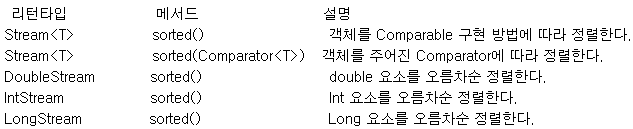

# 스트림 소개
스트림은 자바8부터 추가된 컬렉션의 저장 요소를 하나씩 참조해서 람다식으로 처리할 수 있도록 해주는 반복자 이다.

## 반복자 스트림
자바 7 이전까지는 List<String> 컬렉션에서 요소를 순차적으로 처리하기 위해 Iterator 반복자를 다음과 같이 사용했다.

~~~java
List<String> list = Arrays.asList("홍길동", "신용권", "감자바");
Iterrator<String> iterator = list.iterator();
while(iterator.hasNext()){
    String name = iterator.next();
    System.out.println(name);
}
~~~
이코드를 Stream을 사용해서 변경하면 다음과 같다.
~~~java
List<String> list = Arrays.asList("홍길동", "신용권", "감자바");
Stream<String> stream = list.stream();
stream.forEach ( name -> Systeam.out.println(name) );
~~~
컬렉션의 stream() 메소드로 스트림 객체를 얻고 나서 stream,forEach(name -> Systeam.out.println(name) );메소드를 통해 컬렉션의 요소를 하나씩 콘솔에 출력한다. forEach() 메소드는 다음과 같이 Consumer 함수적 인터페이스 타입의 매개값을 가지므로 컬렉션의 요소를 소비할 코드를 람다식으로 기술할 수 있다.
~~~java
void forEach(Consumer<T> action)
~~~
Iterator를 사용한 코드와 Stream을 사용한 코드를 비교해보면 Stream을 사용하는 것이 훨씬 단순해 보인다.

# 스트림의 특징
Stream은 Iterator와 비슷한 역할을 하는 반복자이지만, 람다식으로 요소를 처리 코드를  제공하는 점과 내부 반복자를 사용하므로 병렬 처리가 쉽다는 점 그리고 중간 처리와 최종 처리 작업을 수행하는 점에서 많은 차이를 가지고 있다.

## 람다식을 요소 처리 코드를 제공한다
Stream이 제공하는 대부분의 요소 처리 메소드는 함수적 인터페이스 매개 타입을 가지기 때문에 람다식 또는 메소드 참조를 이용해서 요소 처리 내용을 매개값으로 전달할 수 있다.

## 내부 반복자를 사용하므로 병렬 처리가 쉽다
외부 반복자(external iterator)란 개발자가 코드로 직접 컬렉션의 요소를 반복해서 가져오는 코드 패턴을 말한다. index를 이용하는 for문 그리고 Iterator를 이용하는 while문은 모두 외부 반복자를 이용하는 것이다. 
반면에 내부 반복자(internal iterator)는 컬렉션 내부에서 요소들을 반복시키고, 개발자는 요소당 처리해야 할 코드만 제공하는 코드 패턴을 말한다. 

내부 반복자를 사용해서 얻는 이점은 컬렉션 내부에서 어떻게 요소를 반복시킬 것인가는 컬렉션에게 맡겨두고, 개발자는 요소 처리 코드에만 집중할 수 있다. 내부 반복자는 요소들의 반복 순서를 변경하거나, 멀티 코어 CPU를 최대한 활용하기 위해 요소들을 분배시켜 병렬 작업을 할 수 있게 도와주기 때문에 하나씩 처리하는 순차적 외부 반복자보다는 효율적으로 요소를 반복시킬 수 있다.

Iterator는 컬렉션의 요소를 가져오는 것에서부터 처리하는 것까지 모두 개발자가 작성해야 하지만, 스트림은 람다식으로 요소를 처리 내용만 전달할 뿐, 반복은 컬렉션 내부에서 일어난다. 스트림을 이용하면 코드도 간결해지지만, 무엇보다도 요소의 병렬 처리가 컬렉션 내부에서 처리되므로 일선 이조의 효과를 가져온다.

병렬(parallel) 처리란 한 가지 작업을 서브 작업으로 나누고, 서브 작업들을 분리된 스레드에서 병렬적으로 처리하는 것을 말한다. 병렬 처리 스트림을 이용하면 런타임 시 하나의 작업을 서브 작업으로 자동으로 나누고, 서브 작업의 결과를 자동으로 결합해서 최종 결과물을 생성한다. 

## 스트림은 중간 처리와 최종 처리를 할 수 있다
스트림은 컬렉션의 요소에 대해 중간 처리와 최종 처리를 수행할 수 있는데, 중간 처리에서는 매핑, 필터링, 정렬을 수행하고 최종 처리에서는 반복, 카운팅, 평균, 총합 등의 집계 처리를 수행한다.

# 스트림의 종류
BaseStream 인터페이스를 부모로 해서 자식 인터페이스들이 다음과 같은 상속관계를 이루고 있다.
BaseStram 인터페이스에는 모든 스트림에서 사용할 수 있는 공통 메소드들이 정의되어 있을 뿐 코드에서 직접적으로 사용되지는 않는다. 하위 스트림인 Stram, IntStram, LongStram, DoubleStram이 직접적으로 이용되는 스트림인데, Stram은 객체 요소를 처리하는 스트림이고, IntStream, LongStream, DoubleStream은 각각 기본타입인 int, long, double 요소를 처리하는 스트림이다. 이 스트림 인터페이스의 구현 객체는 다양한 소스로부터 얻을 수 있다. 주록 컬렉션과 배열에서 얻지만, 다음과 같은 소스로 부터 스트림 구현 객체를 얻을 수도 있다.

## 스트림 파이프 라인
대량의 데이터를 가공해서 축소하는 것을 일반적으로 리덕션(Reduction)이라고 하는데, 데이터의 합계, 평균값, 카운팅, 최대값, 최소값 등이 대표적인 리덕션의 결과물이라고 볼 수 있다. 그러나 컬렉션의 요소를 리덕션의 결과물로 바로 집계할 수 없을 경우에는 집계하기 좋도록 필터링, 매핑, 정렬, 그룹핑 등의 중간 처리가 필요하다.

### 중간 처리와 최종 처리
스트림의 데이터의 필터링, 매핑, 정렬, 그룹핑 등의 중간 처리와 합계, 평균, 카운팅, 최대값, 최소 값등의 최종 처리를 파이프라인(pipelines)으로 해결한다. 파이프라인은 여러 개의 스트림이 연결되어 있는 구조를 말한다. 파이프라인에서 최종 처리를 제외하고는 모두 중간 처리 스트림이다.

중간 스트림이 생성될 때 요소들이 바로 중간 처리(필터링, 매핑, 정렬) 되는 것이 아니라 최종 처리가 시작되기 전까지 중간 처리는 지연(lazy)된다. 최종 처리가 시작되면 비로소 컬렉션의 요소가 하나씩 중간 스트림에서 처리되고 최종 처리까지 오게 된다.
stream 인터페이스에는 필터링, 매핑, 정렬 등의 많은 중간 처리 메소드가 있는데, 이 메소드들은 중간 처리된 스트림을 리턴한다. 그리고 이 스트림에서 다시 중간 처리 메소드를 호출해서 파이프 라인을 형성하게 된다. 예를 들어 회원 컬렉션에서 남자만 필터링하는 중간 스트림을 연결하고, 다시 남자의 나이로 매핑하는 스트림을 연결한 후, 최종 남자 평균 나이를 집계한다면 다음 그림 처럼 파이프라인이 형성된다.

위 그림을 자바 코드로 표현하면 아래와 같습니다.

~~~java
 Stream<Member> maleFemaleStream = list.stream();

 Stream<Member> FemaleStream = maleFemaleStream.filter(m -> .getGender ()==Member.MALE);

 IntStream ageStream = maleStream.mapToInt(Member :: getAge);

 OptionalDouble od = ageStream.average();

 double ageAvg = od.getAsDouble();
~~~

로컬 변수를 생략하고 연결하면 아래와 같은형태의 파이프라인 코드만 남습니다.

~~~java
 double ageAvg = list.stream()                             <== 오리지날 스트림

      .filterm -> .getGender () == Member.MALE)         

     .mapToInt(Member :: getAge)                           <== 중간 처리 스트림

     .average()

     .getAsDouble();                  <== 최종 처리 스트림
~~~

### 중간 처리 메소드와 최종 처리 메서드
스트림 파이프라인에서 중간 처리를 하는 메소드와 최종 처리를 하는 메소드의 종류를 설명한 표

중간 처리 메소드와 최종 처리 메소드를 쉽게 구분하는 방법은 리턴 타입을 보면 된다. 리턴 타입이 스트림이라면 중간 처리 메소드이고, 기본 타입이거나 OptionalXXX라면 최종 처리 메소드이다. 소속된 인터페이스에서 공통의 의미는 Stream, IntStream, LongStream, DoubleStream에서 모두 제공된다는 뜻이다.

## 필터링(distinct(),filter())
필터링은 중간 처리 기능으로 요소를 걸러내는 역할을 한다. 필터링 메소드인 distinct() 와 filter()메소드는 모든 스림이 가지고 있는 공통 메소드이다.

distinct() 메소드는 중복을 제거하는데, Stream의 경우 Object.equals(Object)가 true이면 동일한 객체로 판단하고 중복을 제거한다. IntStream, LongStream, DoubleStream은 동일값일 경우 중복을 제거한다.

filter() 메소드는 매개값으로 주어진 Predicate가 true를 리턴하는 요소만 필터링한다.

## 매핑(flatMapXXX(), mapXXX(), asXXXStream, boxed())
매핑은 중간 처리 기능으로 스트림 요소를 다른 요소로 대체하는 작업을 말한다.
스트림에서 제공하는 매핑 메소드는 flatXXX()와 mapXXX(), 그리고 asDoubleStream(),
asLongStrem(), boxed()가있다.

### flatMapXXX메소드
flatMapXXX() 메소드는 요소를 대체하는 복수 개의 요소들로 구성된 새로운 스트림을 리턴한다.

스트림에서 A라는 요소는 A1, A2 요소로 대체되고, B라는 요소는 B1, B2로 대체된다고 가정했을 경우 A1, A2, B1, B2 요소를 가지는 새로운 스트림이 생성된다.

### mapXXX()메소드
mapXXX() 메소드는 요소를 대체하는 요소로 구성된 새로운 스트림을 리턴한다. 

스트림에서 A 요소는 C요소로 대체되고, B 요소는 D요소로 대체된다고 했을경우 C, D 요소를 가지는 새로운 스트림이 생성된다

### asDoubleStream(), asLongStream(), boxed() 메소드
asDoubleStream() 메소드는 IntStream의 int 요소 또는 LongStream의 long 요소를 double 요소로 타입 변환해서 DoubleStream을 생성한다. 마찬가지로 asLongStream() 메소드는 IntStream의 int 요소를 long 요소로 타입 변환해서 LongStream을 생성한다. boxed() 메소드는 int, long, double 요소를 Integer, Long, Double 요소로 박싱해서 Stream을 생성한다. 

리턴 타입 | 메소드(매개 변수) | 설명
:---|:---|:---
DoubleStream|asDoubleStream()|int -> double  long -> double
LongStream|asLongStream()|int -> long
Stream<'Integer'>   Stream<'Long'>  Stream<'Double'>|boxed()| int -> Integer   double -> Double  long -> Long 

## 정렬(sorted())
스트림은 요소가 최종 처리되기 전에 중간 단계에서 요소를 정렬해서 최종 처리 순서를 변경할 수 있다. 

객체 요소일 경우에는 클래스가 Comparable을 구현하지 않으면 sorted() 메소드를 호출했을때 ClassCastException이 발생하기 때문에 Comparable을 구현한 요소에서만 sorted() 메소드를 호출해야 한다. 

객체 요소가 Comparable을 구현한 상태에서 기본 비교(Comparable) 방법
~~~java
sorted();
sorted( (a,b) -> a.compareTo(b) );
sorted( Comparator.natuuralOrder() );
~~~
객체 요소가 Comparable을 구현하고 있지만, 기본 비교 방법과 정반대 정렬 방법
~~~java
sorted( (a,b) -> b.compareTo(a) );
sorted( Comparator.reverseOrder() );
~~~
객체 요소가 Comparable를 구현하지 않았다면 Comparator를 매개값으로 갖는 sorted() 메소드를 사용하면 된다. Comparator는 함수적 인터페이스이므로 람다식으로 매개값을 작성할 수 있다.
~~~java
sorted( (a,b) -> {...} );
~~~
중괄호 {}안에 a와b를 비교해서 a가 작으면 음수, 같으면 0, a가 크면 양수를 리턴하는 코드를 작성하면된다.

## 루핑(peek(),forEach())
루핑(looping)은 요소 전체를 반복하는것을 말한다.루핑하는 메소드에는 peek(), forEach() 가 있다. 이 두 메소드는 루핑한다는 기능에서는 동일하지만, 동작 방식은 다르다.peek() 는 중간 처리 메소드이고, forEach는 최종 처리 메소드이다.
peek()는 중간 처리 단계에서 전체 요소를 루핑하면서 추가적인 작업을 하기 위해 사용한다. 최종처리 메소드가 실행되지 않으면 지연되기 때문에 반드시 최종 처리 메소드가 호출되어야 동작한다. 예를 들어 필터링 후 어떤 요소만 남았는지 확인하기 위해 peek()를 마지막에서 호출할 경우, 스트림은 동작 하지않는다.
~~~java
intStream.filter(a -> a%2 ==0).peek( a-> Systeam.out.print(a) )
~~~
요소 처리의 최종 단계가 합을 구하는 것이라면, peek() 메소드 호출 후 sum()을 호출해야함 peek()가 정상 동작한다.
~~~java
intStream.filter(a -> a%2 ==0).peek( a-> Systeam.out.print(a) ).sum()
~~~
하지만 forEach() 는 최종 처리 메소드이기 때문에 파이프라인 마지막에 루핑하면서 요소를 하나씩 처리한다. forEach()는 요소를 소비하는 최종 처리 메소드이므로 이후에 sum()과 같은다른 최종 메소드를 호출하면 안 된다.

## 매칭(allMatch(), anyMatch(), noneMatch())
스트림 클래스는 최종 처리 단계에서 요소들이 특정 조건에 만족하는지 조사할 수 있도록 세 가지 매칭 메소드를 제공하고 있다, allMatch() 메소드는 모든 요소들이 매개값으로 주어진 Predicate의 조건을 만족하는지 조사하고, anyMatch() 메소드는 최소한 한 개의 요소가 매개밧으로 주어진 Predicate의 조건을 만족하는지 조사한다. 그리고 noneMatch()는 모든 요소들이 매개값으로 주어진 Predicate의 조건을 만족하지 않는지 조사한다.

## 기본 집계(sum(), count(), average(), max(), min())
집계(Aggregate)는 최종 처리 기능으로 요소들을 처리해서 카운팅, 합계, 평균값, 최대값, 최소값등과 같이 하나의 값으로 산출하는 것을 말한다. 집계는 대량의 데이터를 가공해서 축소하는 리덕션(Reduction)이라고 볼 수 있다.

이 집계 메서드에서 리턴하는 OptionalXXX는 자바 8 에서 추가한 java.util 패키지의 Optional, OptionalDouble, OptionalInt, OptionalLong 클래스 타입을 말한다. 이들은 값을 저장하는 값 기반 클래스(value-based class)들이다. 이 객체에서 값을 얻기 위해서는 get(), getAsDouble(), getAsInt(), getAsLong() 을 호출하면 된다.

## Optional 클래스
Optional, OptionalDouble, OptionalInt, OptionalLong 클래스에 대해서 알아보면 이 클래스들은 저장하는 값의 타입만 다른 뿐 제공하는 기능은 거의 동일 하다. Optional 클래스는 단순히 집계 값만 저장하는 것이 아니라. 집계 값이 존재하지 않을 경우 디폴트 값을 설정할 수도 있고, 집계 값을 처리하는 Consumer도 등록할 수 있다.

컬렉션 요소는 동적으로 추가되는 경우가 많은데 컬렉션의 요소가 추가되지 않아 저장된 요소가 없을 경우
~~~java
List<Integer> list = new ArrayList<>();
double avg = list.stream()
    .mapToInt(Integer :: intValue)
    .averager()
    .getAsDouble();
System.out.println("평균: " + avg);
~~~
요소가 없기 때문에 평균값도 있을 수 없다 그래서NoSuchElementException 예외가 발생한다. 요소가 없을 경우 예외를 피하는 세 가지 방법이 있는데, 첫번째는 Optional 객체를 얻어 isPresent() 메소드로 평균값 여부를 확인하는 것이다. isPresent() 메소드가 true를 리턴할 때만 getAsDouble() 메소드로 평균 값을 얻으면 된다.
~~~java
OptionalDouble optional = list.stream()
    .mapToInt(Integer :: intValue)
    .average();
if(optional.isPresent()){
    System.out.println("평균: " + optional.getAsDouble());
}else{
    System.out.println("평균: 0.0");
}
~~~

두 번째 방법은 orElse() 메소드로 디폴트 값을 정해 놓는다. 평균값을 구할 수 없는 경우에는 orElse()의 매개값이 디폴트 값이 된다.

~~~java
double avg = list.stream()
    .mapToInt(Integer :: intValue)
    .average()
    .orElse(0.0);
System.out.println("평균: " + a)
~~~

세 번째 방법은 ifPresent() 메소드로 평균값이 있을 경우에만 값을 이용하는 람다식을 실행한다.
~~~java
list.stream()
    .mapToInt(Integer :: intValue)
    .average()
    .ifPresent(a -> System.out.println("평균: " + a));
~~~

## 커스텀 집계(reduce())
스트림은 기본 집계 메소드인 sum(), average(), count(), max(), min()을 제공하지만, 프로그램화해서 다양한 집계 결과물을 만들 수 있도록 reduce() 메소드도 제공한다.

각 인터페이스에는 매개 타입으로 XXXOperator, 리턴 타입으로 OptionalXXX, int, long, double을 가지는 reduce() 메소드가 오버로딩되어 있다. 스트림에 요소가 전혀 없을 경우 디폴트값인 identity 메개값이 리턴된다. XXXOperator 매개값은 집계 처리를 위한 람다식을 대입하는데 예를 들어 학생들의 성적 총점은 학생 스트림에서 점수 스트림으로 매핑해서 다음과 같이 없을 수 있다.

~~~java
int sum = studentList.stream()
    .map(Student :: getScore)
    .reduce((a, b) -> a+b)
    .get();
------------------------------------------------------
int sum = studentList.stream()
    .map(Student :: getScore)
    .reduce(0, (a, b) ->a+b);
~~~
위쪽 코드는 스트림에 요소가 없을 경우NosuchElementException이 발생하지만, 오른쪽 코드는 디폴트 값(identity)인 0을 리턴한다. 스트림에 요소가 있을 경우에는 두 코드 모두 동일한 결과를 산출한다.

## 수집(collect())
스트림은 요소들을 필터링 또는 매핑한 후 요소들을 수집하는 최종 처리 메소드인 collect()를 제공하고 있다. 이 메소드를 이용하면 필요한 요소만 컬렉션으로 담을 수 있고, 요소들을 그룹핑한 후 집계(리덕션)할 수 있다

### 필터링한 요소 수집
Stream 의 collect(Collector<T,A,R> collector) 메소드는 필터링 또는 매핑된 요소들을 새로운 컬렉션에 수집하고, 이 컬렉션을 리턴한다.
리턴 타입 | 메소드(매개 변수) | 인터페이스
---|---|---
R|collect(Collector<T,A,R>collector)|stream

매개값인 Collector는 어떤 요소를 어떤 컬렉션에 수집할 것인지를 결정한다. Collector의 타입 파라미터 T는 요소이고, A는 누적기(accumulator)이다. 그리고 R은 요소가 저장될 컬렉션이다. 풀어서 해석하면 T 요소를 A 누적기가 R에 저장한다는 의미이다. Collector의 구현 객체는 Collectors 클래스의 다양한 정적 메소드를 이용해서 얻을 수 있다.
리턴타입|Collectors의 정적 메서드|설명
---|---|---
Collector<T, ?, List<T>>|toList()|T를 List에 저장.
Collector<T, ?, Set<T>>|toSet()|T를 Set에 저장.
Collector<T, ?, Collection<T>>|toCollection(Supplier<Collection<T>>)|T를 Supplier가 제공한 Collection에 저장.
Collector<T,? Map<T,U>>|toMap( Function<T,K> keyMapper,  Function<T,U> valueMapper)|T를 K와 U로 매핑, K를 키로, U를 값으로 Map에 저장.
Collector<T, ?, ConcurrentMap<K,U>>|toConcurrentMap( Function<T,K>keyMapper, Function<T,U>valueMapper)|T를 K와 U로 매핑, K를 키로, U를 값으로 ConcurrentMap에 저장

리턴값인 Collector를 보면 A(누적기)가 ? 로 되어 있는데, 이것은 Collector가 R(컬렉션에 ) T(요소)를 저장하는 방법을 알고 있어 A(누적기)가 필요 없기 때문이다. Map과 ConcurrentMap의 차이점은 Map은 스레드에 안전하지 않고,  ConcurrentMap은 스레드에 안전하다. 멀티 스레드 환경에서 사용하려면 ConcurrentMap을 얻는 것이 좋다
~~~java
//전체 학생 중에서 남학생들만 필터링해서 별도의 List로 생성
1. Stream<Student> totalStream = totalList.stream();
2. Stream<Student> maleStream = totalStream.filter(s->s.getSex()==Student.Sex.MALE);
3. Collector<Student, ?, List<Student>> collector = Collectors.toList();
4. List<Student> maleList = maleStream.collect(collector);
~~~
1. 전체 학생 List에서 Stream을 얻는다. 
2. 남학생만 필터링해서 Stream을 얻는다.
3. List에 Student를 수집하는 Collector를 얻는다.
4. Stream에서 collect() 메소드로 Student를 수집해서 새로운 List를 얻는다
~~~java
//변수를 생략해서 작성한 코드
    List<Student> maleList = totalList.stream()
        .filter(s->s.getSex()==Student.Sex.MALE)
        .collect(Collectors.toList());
~~~
~~~java
//전체 학생 중에서 여학생들만 필터링해서 별도의 HashSet으로 생성
1. Stream<Student> totalStream = totalList.stream();
2. Stream<Student> femaleStream = totalStream.filter(s->s.getSex()==Student.Sex.FeMale);
3. Supplier<HashSet<Student>> supplier = HashSet :: new;
4. Collector<Student, ?, HashSet<Student>> collector = Collectors.toCollection(supplier);
5. Set<Student> femaleSet = femaleStream.collect(collector);
~~~
1. 전체 학생 List에서 Stream을 얻는다 
2. 여학생만 필터링해서 Stream을 얻는다 
3. 새로운 HashSet을 공급하는 Supplier를 얻는다. 
4. Supplier가 공급하는 HashSet에 Student를 수집하는 Collector를 얻는다.
5. Stream에서 collect() 메소드로 Student를 수집해서 새로운 HashSet을 얻는다
~~~java
//변수를 생략해서 작성한 코드
Set<Student> femaleSet = totalList.stream()
    .filter(s -> s.getSex() == Student.Sex.FEMALE)
    .collect(Collectors.toCollection(HashSet :: new ));
~~~

### 사용자 정의 컨테이너에 수집하기
List, Set, Map과 같은 컬렉션이 아니라 사용자 정의 컨테이너 객체에 수집하는 방법을 알아보자 스트림은 요소들을 필터링, 또는 매핑해서 사용자 정의 컨테이너 객체에 수집할 수 있도록  collect() 메소드를 추가 제공한다

인터페이스 | 리턴 타입 | 메소드(매개변수)
---|---|---
Stream|R| collect(Supplier<R> , BiConcumer<R,?,super T>, BiConsumer<R,R>)
IntStream|R|collect(Supplier<R> , ObjIntConcumer<R>, BiConsumer<R,R>)
LongStream|R|collect(Supplier<R> , ObjLongConcumer<R>, BiConsumer<R,R>)
DoubleStram|R|collect(Supplier<R> , ObjDoubleConcumer<R>, BiConsumer<R,R>)

첫 번째 Supplier는 요소들이 수집될 컨테이너 객체(R)를 생성하는 역할을 하며 순차 처리(싱글 스레드) 스트림에서는 단 한번 Supplier가 실행되고 스레드별로 여러 개의 컨테이너 객체를 생성한다. 병렬 처리(멀티 스레드) 스트림에서는 여러 번 Supplier가 실행되고 스레드별로 여러 개의 컨테이너 객체를 생성한다. 하지만 최종적으로 하나의 컨테이너 객체로 결합된다.

두번째XXXConsumer는 컨테이너 객체(R)에 요소(T)를 수집하는 역할을 한다. 스트림에서 요소를 컨테이너에 수집할 때마다 XXXConsumer가 실행된다.

세번째 BIConsumer는 컨테이너 객체(R)를 결합하는 역할을 한다. 순차 처리 스트림에서는 호출되지 않고 병렬 처리 스트림에서만 호출되어 스레드별로 생성된 컨테이너 객체를 결합해서 최종 컨테이너 객체를 완성한다.

리턴 타입R은 요소들이 최종 수집된 컨테이너 객체이다. 순차 처리 스트림에서는 리턴 객체가 첫번째 Supplier가 생성한 객체지만, 병렬 처리 스트림에서는 최종 결합된 컨테이너 객체가 된다.

### 요소를 그룹핑해서 수집
collect() 메소드는 단순히 요소를 수집하는 기능 이외에 컬렉션의 요소들을 그룹핑해서 Map객체를 생성하는 기능도 제공한다. collect()를 호출할 때 Collectors의 groupingBy() 또는 groupingByConcurrent()가 리턴 하는 Collector를 매개값으로 대입하면 된다. groupingBy()는 스레드에 안전하지 않은 Map을 생성하지만, groupingByConcurrent()는 스레드에 안전한 ConcurrentMap을 생성한다.

리턴 타입| Collectors의 정적 메소드 | 설명
---|---|---
Collector<T,?,Map<K.List<T>>>|groupingBy(Function<T,K>classifier)|T를 K로 매핑하고K키에 저장된 List에 T를 저장한 Map생성|
Collector<T,?, ConcurrentMap<K.List<T>>>|groupingByConcurrent (Function<T,K>classifier)|T를 K로 매핑하고K키에 저장된 List에 T를 저장한 Map생성
Collector<T,?,Map<K,D>>|groupingBy( Function<T,K>classifier, Collector<T,A,D>collector)|T를 K로 매핑하고 K키에 저장된D객체에 T를 누적한 Map 생성
Collector<T,?, ConcurrentMap<K,D>>|grouppingByConcurrent( Function<T,K>classifier, Collector<T,A,D>collector)|T를 K로 매핑하고 K키에 저장된D객체에 T를 누적한 Map 생성
Collector<T,?,Map<K,D>>|groupingBy( Function<T,K>classifier, Supplier<Map<K,D>>mapFactory, Collector<T,A,D>collector)|T를 K로 매핑하고 Supplier 가 제공하는 Map에서 K키에 저장된 D객체에 T를누적
Collector<T,?, ConcurrentMap<K,D>>|groupingByConcurrent( Function<T,K>classifier, Supplier<ConcurrentMap<K,D>>, mapFactory, Collector<T,A,D>collector)|T를 K로 매핑하고 Supplier가 제공하는 Map에서 K키에 저장된 D객체에 T를 누적

~~~java
//학생들을 성별로 그룹핑하고 나서, 같은 그룹에 속하는 학생 List를 생성한 후, 성별을 키로, 학생 List를 값으로 갖는 Map을 생성한다. collect()의 매개값으로 gropingBy(Function<T,K>classifier)를 사용하였다.
1. Stream<Student> totalStream = totalList.stream();
2. Function<Student, Student.Sex> classifier = Student :: getSex;
3. Collector<Student, ?, Map<Student.Sex, List<Student>>> collector = collectors.groupingBy(classifier);
4. Map<Student.Sex, List<Student>> mapBySex = totalStream.collect(collector);
~~~
1. 전체학생 List에서 Stream을 얻는다.
2.  2.Student를 Student.Sex로 매핑하는 Function을 얻는다. 
3.  Student.Sex가 키가 되고, 그룹핑된 List<'Student'>가 값인 Map을 생성하는 Collector를 얻는다.
4.  Stream의 collect() 메소드로 Student를 Sudent.Sex별로 그룹핑해서 Map을 얻는다
~~~java
//변수를 생략해서 작성
Map<Student.Sex, List<Student>> mapBySex = totalList.stram()
    .collect(Collectors.groupingBy(Student :: getSex));
~~~

### 그룹핑 후 매핑 및 집계
collectors.groupingBy() 메소드는 그룹핑 후, 매피이나 집계(평균, 카운팅, 연결, 최대, 최소, 합계)를 할 수 있도록 두번쨰 매개값으로 Collector를 가질 수 있다. Collector를 리턴하는 메소드를 제공하고 있다.

~~~java
//학생들을 성별로 그룹핑한 다음 같은 그룹에 속하는 학생들의 평균 점수를 구하고, 성별을 키로, 평균 점수를 값으로 갖는 Map을 생성
1. Stream<Student> totalStream = totalList.stream();
2. Fuction<Student, Student.Sex> classifier = Student :: getSex;
3. ToDoubleFunction<Student> mapper = Student :: getScore;
4. Collector<Student, ?, Double> collectr1 = Collectors.averagingDouble(mapper);
5. Collector<Student, ?, Map<Student.Sex, Double>> collector2 = Collectors.groupingBy(classifier, collector1);
6. Map<Student.Sex, Double> mapBySex = totalStream.collect(collector2);
~~~
1. 전체 학생 List에서 Stream을 얻는다.
2. Student 를 Student.Sex로 매핑하는 Function을 얻는다.
3. Student를 점수로 매핑하는 ToDoubleFunction을 얻는다.
4. 학생 점수의 평균을 산출하는 Collector를 얻는다.
5. Student.Sex가 키이고, 평균 점수 Double이 값인 Map을 생성하는 Collector를 얻는다.
6. Stream의 collect() 메소드로 Student를 Student.Sex별로 그룹핑해서 Map을 얻는다
~~~java
//변수를 생략한 코드
Map<Student.Sex, Double> mapBySex = totalList.stram()
    .collect(
            Collectors.groupingBy(
                    Student :: getSex,
                    Collectors.averagingDouble(Student :: getScore)
            )
    );
~~~
~~~java
//학생들을 성별로 그룹핑한 다음 같은 그룹에 속하는 학생 이름을 쉼표로 구분해서 문자열로 만들고, 성별을 키로, 이름 문자열을 값으로 갖는 Map을 생성
Map<Student.Sex, String> mapByName = totalList.stream()
    .collect(
            Collectors.groupingBy(
                Student :: getSex,
                Collectors.mapping(
                    Student :: getName,
                    Collectors.joining(",")
                )
            )
    );
~~~

## 병렬 처리 
병렬 처리(Parallel Operation)란 멀티 코어 CPU 환경에서 하나의 작업을 분할해서 각각의 코어가 병렬적으로 처리하는 것을 말하는데, 병렬 처리의 목적은 작업 처리 시간을 줄이기 위한 것이다.
자바 8부터 요소를 병렬 처리할 수 있도록 하기 위해 병렬 스트림을 제공하기 때문에 컬렉션(배열)의 전체 요소 처리 시간을 줄여 준다.

### 동시성과 병렬성
멀티 스레드는 동시성 또는 병렬성으로 실행되기 때문에 이 둘은 멀티 스레드의 동작 방식이라는 점에서는 동일하지만 서로 다른 목적을 가지고 있다. 동시성은 멀티 작업을 위해 멀티 스레드가 번갈아가며 실행하는 성질을 말하고, 병렬성은 멀티 작업을 위해 멀티 코어를 이용해서 동시에 실행하는 성질을 말한다. 싱글 코어 CPU를 이용한 멀티 작업은 병렬적으로 실행되는 것처럼 보이지만, 사실은 번갈아가며 실행하는 동시성작업이다. 번갈아가면 실행하는 것이 워낙 빠르다보니 병렬성으로 보일 뿐이다. 병렬성은 데이터 병렬성과 작업 병렬성으로 구분할 수 있다.

### 데이터 병렬성
데이터 병렬성은 전체 데이터를 쪼개어 서브 데이터들로 만들고 이 서브 데이터들을 병렬 처리해서 작업을 빨리 끝내는 것을 말한다. 자바 8에서 지원하는 병렬 스트림은 데이터 병렬성을 구현한 것이다. 멀티 코어의 수만큼 대용량 요소를 서브 요소들로 나누고, 각각의 서브 요소들을 분리된 스레드에서 병렬 처리시키낟. 예를 들어 쿼드 코어 CPU일 경우 4개의 서브 요소들로 나누고, 4개의 스레드가 각각의 서브 요소들을 병렬 처리한다.

### 작업 병렬성
작업 병렬성은 서로 다른 작업을 병렬 처리하는 것을 말한다.. 작업 병렬성의 대표적인 예는 웹서버 이다. 웹 서버는 각각의 브라우저에서 요청한 내용을 개별 스레드에서 병렬로 처리한다.

### 포크조인(ForkJoin)프레임워크
병렬 스트림은 요소들을 병렬 처리하기 위해 포크조인 프레임워크를 사용한다. 병렬 스트림을 이용하면 런타임 시에 포크조인 프레임워크가 동작하는데, 포크 단계에서는 전체 데이터를 서브 데이터로 분리한다. 그리고 나서 서브 데이터를 멀티 코어에서 병렬로 처리한다. 조인 단계에서는 서브 결과를 결합해서 최종 결과를 만들어 낸다. 예를 들어 쿼드 코어 CPU에서 병렬 스트림으로 작업을 처리할 경우, 스트림의 요소를 N개라고 보았을 때 포크 단계에서는 전체 요소를 4등분한다. 그리고 1등분씩 개별 코어에서 처리하고 조인 단계에서는 3번의 결합 과성을 거쳐 최종 결과를 산출한다.

병렬 처리 스트림은 실제로 포크 단께에서 차례대로 요소를 4등분하지 않는다. 이해하기 쉽도록 하기 위해 위 그림은 차레대로 4등분했지만, 내부적으로 서브 요소를 나누는 알고리즘이 있다. 포크조인 프레임워크는 포크와 조인 기능 이외에 스레드풀인 ForkJoinPool을 제공한다. 각각의 코어에서 서브 요소를 처리하는 것은 개별 스레드가 해야 하므로 스레드 관리가 필요하다. 포크조인 프레임워크는 ExecutorService의 구현 객체인 ForkJoinPool을 사용해서 작업 스레드를 관리 한다.

### 병렬 스트림 생성
병렬 처리를 위해 코드에서 포크조인 프레임워크를 직접 사용할 수는 있지만, 병렬 스트림을 이용할 경우에는 백그라운에서 포크 조인 프레임워크가 사용되기 때문에 개발자는 매우 쉽게 병렬 처리를 할 수 있다. 병렬 스트림은 두가지 메소드로 얻을 수 있다
인터페이스 | 리턴 타입 | 메소드(매개 변수)
---|----|---
java.util.Collection|Stram|parallelStram()
java.util.Stram.Stream java.util.Stram.IntStream java.util.Stram.LongStream java.util.Stram.DoubleStream|Stream IntStream LongStream DoubleStream|parallel()

parallelStram() 메소드는 컬렉션으로부터 병렬 스트림을 바로 리턴한다. parallel() 메소드는 순차 처리 스트림을 병렬 처리 스트림으로 변환해서 리턴한다. 어떤 방법으로 병렬 스트림을 얻더라도 이후 요소 처리 과정은 병렬 처리된다. 내부적으로 전체 요소를 서브 요소들로 나누고, 이 서브 요소들은 개별 스레드가 처리한다. 서브 처리 결과가 나오면 결합해서 마지막으로 최종 처리 결과를 리턴한다.
~~~java
//수정전코드
MaleStudent maleStudent = totalList.stream()
    .filter(s -> s.getSex() == Student.Sex.MALE)
    .collect(MaleStudent :: new, MaleStudent :: accumulate, MaleStudent :: combine);
~~~
전체 학생 목록에서 stream() 메소드로 순차 처리 스트림을 얻었기 때문에 MaleStudent 객체는 하나만 생성되고, 남학생을 MaleStudent에 수집하기 위해 accumulate()가 호출된다.
co,bine() 메소드는 전혀 호출되지 않았는데, 그 이유는 순차 처리 스트림이므로 결합할 서브 작업이 없기 때문이다. 
~~~java
//병렬 처리 스트림으로 변경
MaleStudent maleStudent = totalList.parallelStream()
    .filter(s -> s.getSex() == Student.Sex.MALE)
    .collect(MaleStudent :: new, MaleStudent :: accumulate, MaleStudent :: combine);
~~~
단순히 stream() 메소드 호출이 parallelStream() 메소드 호출로 변경되었지만 내부 동작은 다음과 같은 순서로 전혀 다르게 진행된다.

1. 쿼드 코어CPU에서 실행된다면 전체 요소는 4개의 서브 요소로 나눠지고, 4개의 스레드가 병렬 처리한다. 각스레드는 서브 요소를 수집해야 하므로 4개의 MaleStudent 객체를 생성하기 위해  collect()의 첫 번째 메소드 참조인 MaleStudent :: new를 4번 실행시킨다.
2. 각 스레드는 MaleStudent 객체에 남학생 요소를 수집하기 위해 두 번째 메소드 참조인 MaleStudent :: accumulate를 매번 실행시킨다.
3. 수집이 완료된 4개의 MaleStudent는 3번의 결합으로 최종MaleStudent가 만들어질 수 있으므로 세 번째 메소드 참조인 MaleSudent :: combine이 3번 실행된다.

### 병렬 처리 성능
스트림 병렬 처리가 스트림 순차 처리보다 항상 실행 성능이 좋다고 판단해서는 안 된다. 병렬 처리에 영향을 미치는 요인 3가지

1. 요소의 수와 요소당 처리 시간
   
   컬렉션에 요소의 수가 적고 요소당 처리 시간이 짧으면 순차 처리가 오히려 병렬 처리보다 빠를 수 있다. 병렬 처리는 스레드풀 생성, 스레드 생성이라는 추가적인 비용이 발생하기 때문이다.
2. 스트림 소스의 종류
   ArrayList, 배열은 인덱스로 요소를 관리하기 때문에 포크 단계에서 요소를 쉽게 분리할 수 있어 병렬 처리 시간이 절약된다. 반면에 HashSet, TreeSet은 요소 분리가 쉽지 않고, LinkedList 역시 링크를 따라가야 하므로 요소 분리가 쉽지 않다. 따라서 이 소스들은 ArrayList, 배열보다는 상대적으로 병렬 처리가 늦다.
3. 코어(Core)의 수
   싱글 코어 CPU일 경우에는 순차 처리가 빠르다. 병렬 스트림을 사용할 경우 스레드의 수만 증가하고 동시성 작업으로 처리되기 때문에 좋지 못한 결과를 준다. 코어의 수가 많으면 많을 수록 병렬 작업 처리 속도는 빨라진다. 